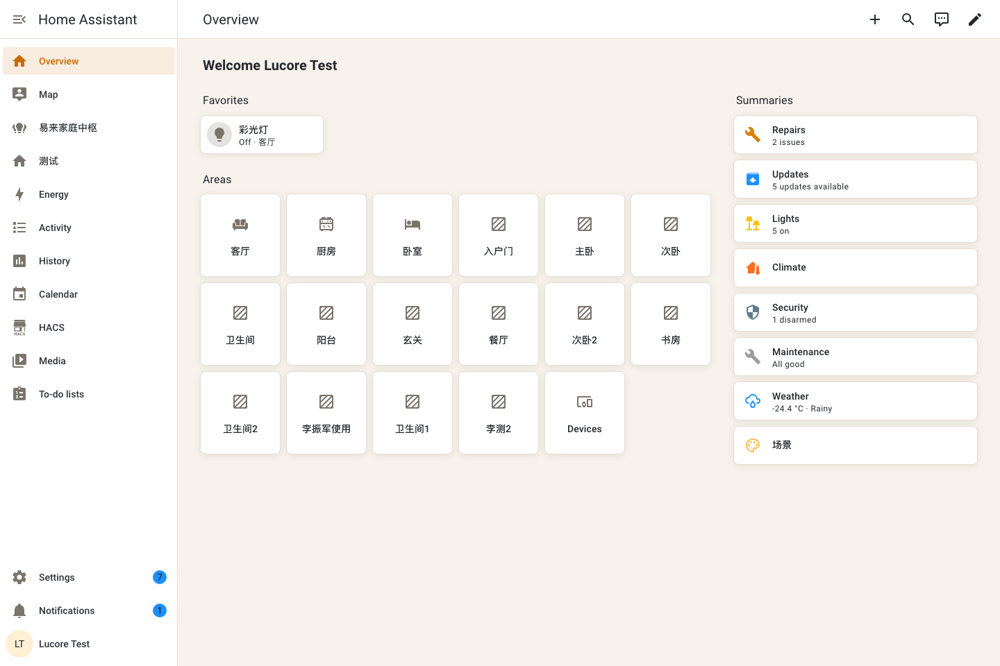
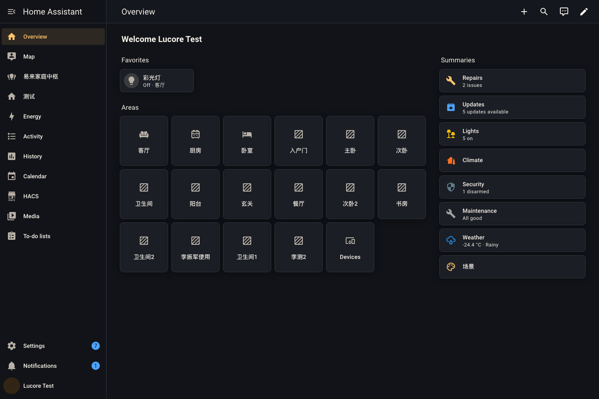
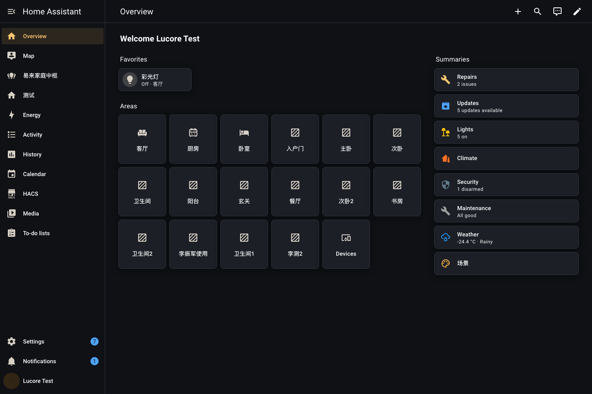
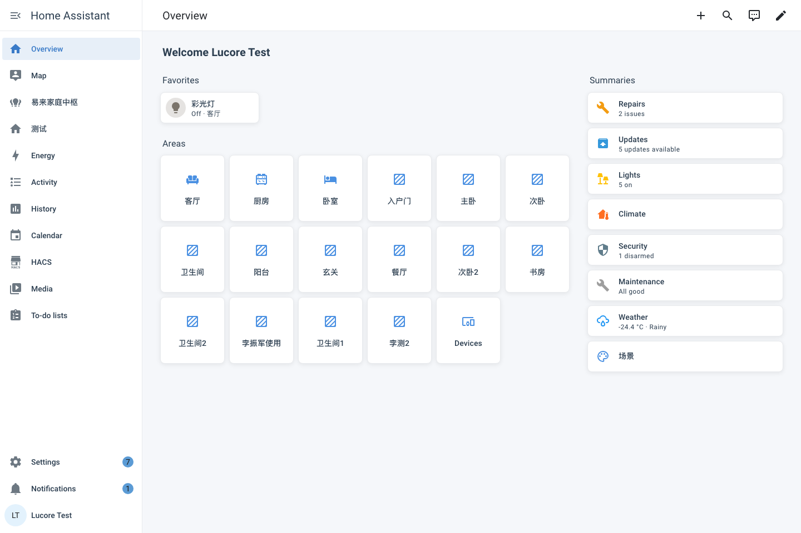
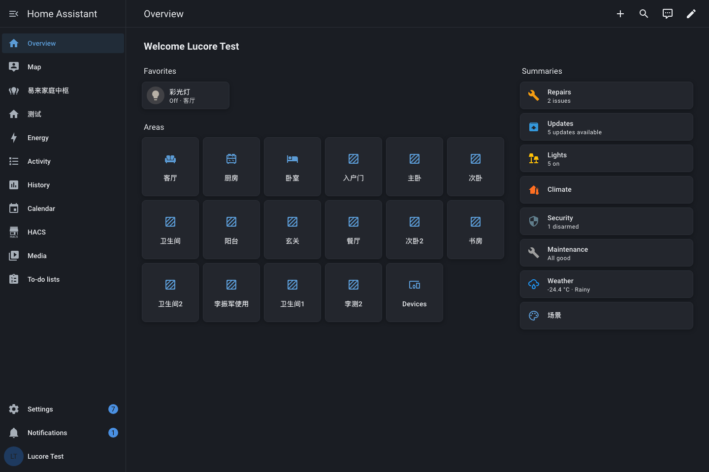
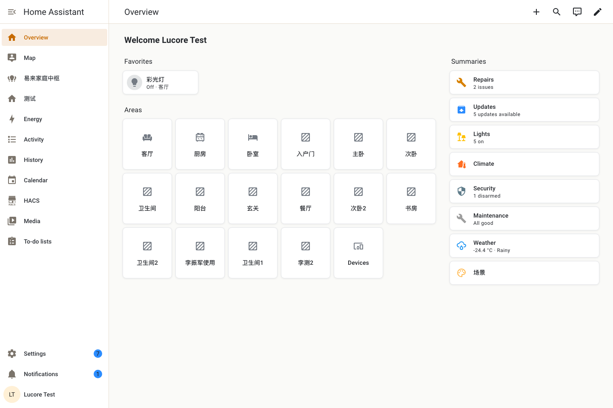
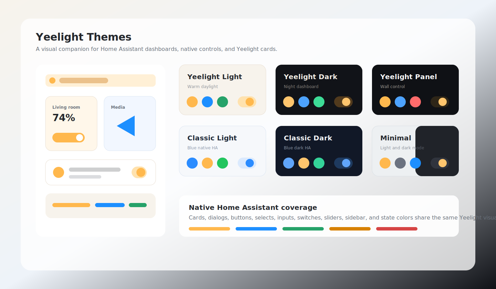

# Yeelight Themes

[English](README.md) | [中文](README_zh.md)

Yeelight-branded theme pack for Home Assistant. This repository is an optional companion for Yeelight cards and dashboards: it keeps the native Home Assistant UI, built-in controls, and Yeelight card package on the same visual system.

Themes affect visuals only. They do not add a lighting interaction model, service calls, automations, or a backend integration.

## Real Home Assistant screenshots

These screenshots are captured from a real Home Assistant instance after selecting each theme through the Home Assistant frontend user preference API.

| Yeelight Light | Yeelight Dark | Yeelight Panel |
| --- | --- | --- |
|  |  |  |

| Yeelight Classic Light | Yeelight Classic Dark | Yeelight Minimal |
| --- | --- | --- |
|  |  |  |

## Theme overview



## Features

- Yeelight Light, Yeelight Dark, Yeelight Panel, Yeelight Classic Light, Yeelight Classic Dark, and Yeelight Minimal
- Native Home Assistant variables for cards, dialogs, buttons, selects, inputs, switches, sliders, and sidebar
- State colors for common HA domains including lights, switches, fans, covers, media players, locks, alarms, and updates
- `yl-*` companion tokens for Yeelight cards
- No integration or JavaScript dependency

## Installation

### HACS Installation

[](https://my.home-assistant.io/redirect/hacs_repository/?owner=Yeelight&repository=ha_yeelight_themes&category=theme)

1. Open HACS.
2. Add this repository as a custom repository with category **Theme**, or install it from the HACS theme catalog when available.
3. Install **Yeelight Themes**.
4. Run the Home Assistant service `frontend.reload_themes`, or restart Home Assistant.

### Manual Installation

1. Copy `themes/yeelight.yaml` to `config/themes/yeelight.yaml`.
2. Make sure Home Assistant loads theme files:

```yaml
frontend:
  themes: !include_dir_merge_named themes
```

3. Run `frontend.reload_themes`, or restart Home Assistant.

## Compatibility

- Home Assistant 2024.1.0 or newer.
- HACS 2.0.0 or newer when installed through HACS.
- No custom integration is required. The theme file is loaded by Home Assistant's built-in `frontend` integration.

## Usage

1. Go to Settings → Appearance.
2. Select theme:
   - **Yeelight Light**: warm daylight interface for regular dashboards.
   - **Yeelight Dark**: dark interface for night use and wall-mounted displays.
   - **Yeelight Panel**: high-contrast dark theme adapted from the older Yeelight wall-panel theme.
   - **Yeelight Classic Light**: blue light theme adapted from the older Lucore light theme with better native HA control coverage.
   - **Yeelight Classic Dark**: blue dark theme adapted from the older Lucore dark theme with better native HA control coverage.
   - **Yeelight Minimal**: lower-contrast theme with Home Assistant light/dark mode support.

## Theme Variables

Each theme defines standard HA variables before Yeelight-specific variables:

| Group | Examples |
| --- | --- |
| Core palette | `primary-color`, `accent-color`, `dark-primary-color`, `light-primary-color` |
| Surfaces | `primary-background-color`, `secondary-background-color`, `card-background-color`, `ha-card-background` |
| Native controls | `mdc-theme-primary`, `input-fill-color`, `switch-checked-color`, `slider-color`, `paper-item-icon-color` |
| Entity states | `state-light-active-color`, `state-switch-active-color`, `state-lock-locked-color`, `state-alarm_control_panel-armed_away-color` |
| Feedback | `success-color`, `warning-color`, `error-color`, `info-color` |
| Yeelight cards | `yl-accent`, `yl-surface`, `yl-text`, `yl-muted`, `yl-radius-card`, `yl-card-shadow`, `yl-hero-glow-color` |

## Release Validation

Every release is checked with:

```bash
npm run validate
```

The validation covers the exported theme names, required Home Assistant variables, state colors, Yeelight companion tokens, real screenshot evidence, HACS package shape, HACS default-store PR body hygiene, and the Lucore Home Assistant Docker sync path that copies this package into `/config/themes/yeelight.yaml`.

To refresh screenshots against a local Home Assistant instance:

```bash
HA_URL=http://localhost:18124 HA_USERNAME=<user> HA_PASSWORD=<password> npm run screenshots:ha
```

The screenshot script saves each theme through Home Assistant's `frontend/set_user_data` API, reloads the dashboard, checks the active theme and CSS variables, and writes `assets/screenshots/ha-theme-screenshots.json`.

## Customization

You can override any variable by copying the theme into your own YAML file and changing the values:

```yaml
frontend:
  themes:
    My Yeelight Light:
      primary-color: "#FFB84D"
      accent-color: "#2B8CFF"
```

For Yeelight cards, prefer overriding `yl-*` tokens first. For native Home Assistant controls, prefer standard HA variables such as `primary-color`, `ha-card-background`, `divider-color`, and `state-*-color`.

## Scope

This package only styles Home Assistant. Lighting controls, device discovery, automations, and service calls belong to Home Assistant integrations or Lovelace cards, not to themes.

## License

MIT License
